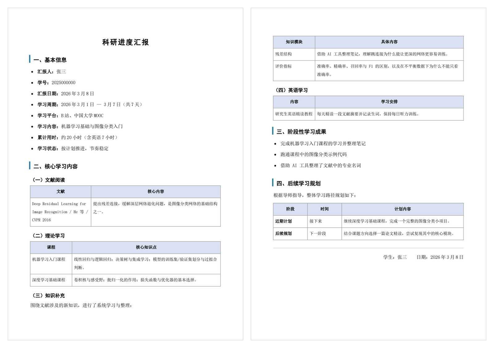

# 科研进度汇报 Skill

把「这周学了什么」变成一份排版规范的 Word 汇报文档。

给它一段简单描述（甚至一张课程截图），它直接生成 `.docx`：A4 纸、宋体正文、黑体标题、浅蓝色表头表格——**不需要你复制粘贴代码，也不用改文件后缀名**。

> 面向需要定期向导师提交学习汇报的研究生。标题、字段、章节结构都可以按自己学校的模板改。

---

## 它长什么样



> 上图由本技能自带脚本生成（示例内容为虚构）。A4、宋体正文 12pt 1.8 倍行距、黑体标题、浅蓝表头表格。

生成出来的文档结构：

```
科研进度汇报
一、基本信息      （汇报人、学号、汇报日期、学习周期、学习平台、学习内容、累计用时、学习状态）
二、核心学习内容
    （一）文献阅读   （一）～（四）按实际有内容的板块自动编号
    （二）理论学习
    （三）知识补充
    （四）英语学习
三、阶段性学习成果
四、后续学习规划
落款：学生：×××　　日期：×××
```

版式细节（都可以改，见「自定义」）：

| 元素 | 样式 |
|---|---|
| 页面 | A4，页边距 上下 25mm / 左右 20mm |
| 正文 | 宋体 12pt，1.8 倍行距 |
| 大标题 | 黑体 18pt 加粗居中，字间距 2pt |
| 二级标题 | 黑体 14pt，左侧 3pt 蓝色（`#2C7DA0`）竖条 |
| 三级标题 | 黑体 12.5pt |
| 表格 | 边框 0.75pt `#888888`，表头 `#D9E1F2` 底纹、加粗居中，正文 10.5pt |
| 落款 | 右对齐，上方一条浅灰分隔线 |

---

## 目录结构

```
research-study-report/          ← 把这个文件夹整个复制到技能目录即可
├── SKILL.md                    技能说明（Agent 读它来决定什么时候用、怎么用）
├── scripts/
│   ├── build_study_report.py   生成 .docx 的脚本（python-docx）
│   ├── sample_input.json       输入示例，照着改就行
│   └── verify_layout.py        版式验收：量 PDF 里正文与表格的真实坐标
└── references/
    └── 学习背景.example.md      个人背景模板（复制成 学习背景.md 后填写）
```

---

## 安装

技能就是「一个装着 `SKILL.md` 的文件夹」，放进 Agent 会扫描的技能目录即可。

**方式一：只在一个项目里用**
把 `research-study-report` 文件夹放到工作区的 `skills/` 下：

```
<你的项目>/skills/research-study-report/SKILL.md
```

**方式二：所有项目都能用（推荐）**
放到用户技能目录：

```
~/.dsh/skills/research-study-report/SKILL.md      （DeepSeek Harness 默认位置）
~/.agents/skills/research-study-report/SKILL.md   （共享的 agent 配置目录）
```

**方式三：用配置指定目录**
在 DSH 的 profile 补丁里给技能插件加一个自定义根目录：

```yaml
- id: <skill 插件的 id>
  config:
    customSkillDirs:
      - D:\my-skills
```

放好之后不需要重启，技能目录会被自动扫描到。

> 技能采用 `SKILL.md` + YAML frontmatter（`name` / `description`）的通用写法；其他支持该约定的 Agent 工具同样可以复用这个目录。

---

## 用法

### 1. 先填一份自己的背景（只需一次）

把 `references/学习背景.example.md` 复制成 `references/学习背景.md`，填上自己的课程清单、已读文献、产出、长期规划。
之后每一期汇报都从它出发，**不用再重复讲背景**。

### 2. 准备这一期的输入 JSON

照 `scripts/sample_input.json` 改。字段都可选，没内容的板块直接不写（会被整块删掉）：

```json
{
  "title": "科研进度汇报",
  "student": "张三",
  "studentId": "2025000000",
  "reportDate": "2026年3月8日",
  "period": "2026年3月1日 — 3月7日（共7天）",
  "platform": "B站",
  "summary": "机器学习基础",
  "hours": "约20小时",
  "status": "按计划推进",
  "literature":  [{"item": "论文标题/作者/期刊", "content": "核心内容"}],
  "theory":      [{"item": "课程名", "content": "核心知识点"}],
  "supplement":  [{"item": "知识模块", "content": "具体内容"}],
  "english":     [{"item": "英语内容", "content": "学习安排"}],
  "achievements": ["阶段性成果"],
  "plan": {"near": "近期计划", "next": "后续规划"}
}
```

### 3. 生成

```bash
python scripts/build_study_report.py 输入.json 科研进度汇报_2026-03-08.docx
```

### 4. 校验（可选）

```bash
python scripts/verify_layout.py 科研进度汇报_2026-03-08.pdf
```

它会打印正文与表格在页面上的真实坐标（预期：左边界 ≈20mm、正文右边界 ≈190mm），用来确认页边距和列宽没跑偏——比肉眼看渲染图可靠。

---

## 依赖

- **Python 3.8+** 和 `python-docx`：`pip install python-docx`
- 可选：LibreOffice（把 docx 转成 PDF 做目视验收）
- 脚本只用标准库 + python-docx，没有其他依赖

---

## 自定义

改 `scripts/build_study_report.py` 顶部的常量即可：

```python
SONG = "宋体"        # 正文字体
HEI = "黑体"         # 标题字体
BODY_PT = 12.0       # 正文字号
LINE = 1.8           # 正文行距
HEAD_FILL = "D9E1F2" # 表头底纹
ACCENT = "2C7DA0"    # 二级标题左侧竖条
```

其他可调项：

- **标题**：JSON 里的 `title`，默认「科研进度汇报」
- **紧凑排版**：JSON 里 `"compact": true`，只收紧段间距和单元格内边距（内边距 5pt→3pt），往页面里多塞一些内容，正文行距和字号不动。内容多、落款被挤到单独一页时很有用。
- **知识补充的引导句**：JSON 里 `supplementIntro`，默认「围绕文献涉及的新知识，进行了系统学习与整理：」
- **章节完全自定义**：JSON 里的 `contentSections` 可以把「（一）文献阅读 ～（四）英语学习」整段换成你自己的结构，表格或项目符号列表都行，序号自动重排。现成例子见 `scripts/sample_sections.json`。
- **章节编号**：二级标题下的（一）（二）（三）按实际出现的章节自动重排，删掉某个章节不会留下空号

---

## 已知限制

- `python-docx` 不做分页计算，最终分页由 Word 决定；LibreOffice 的分页与 Word 可能有一两行差异。脚本已经做了几件事来避免难看的排版：表格行不跨页断开、跨页时重复表头、表头不会孤零零留在页尾。
- 在高 DPI 缩放的机器上（例如 Windows 显示缩放 200%），直接渲染 `.docx` 时 LibreOffice 光栅后端会把页面放大 2 倍后只截左上角，看着像"内容溢出"。**这是渲染环境问题，不是文档问题**——所以 `verify_layout.py` 走的是"先转 PDF、再量坐标"的路线。
- 字体依赖系统里的宋体/黑体（Windows 自带；Linux 下需要装中文字体，否则会回退）。

---

## 许可

MIT，见 [LICENSE](LICENSE)。技能模板本身可按自己的需要任意修改。
